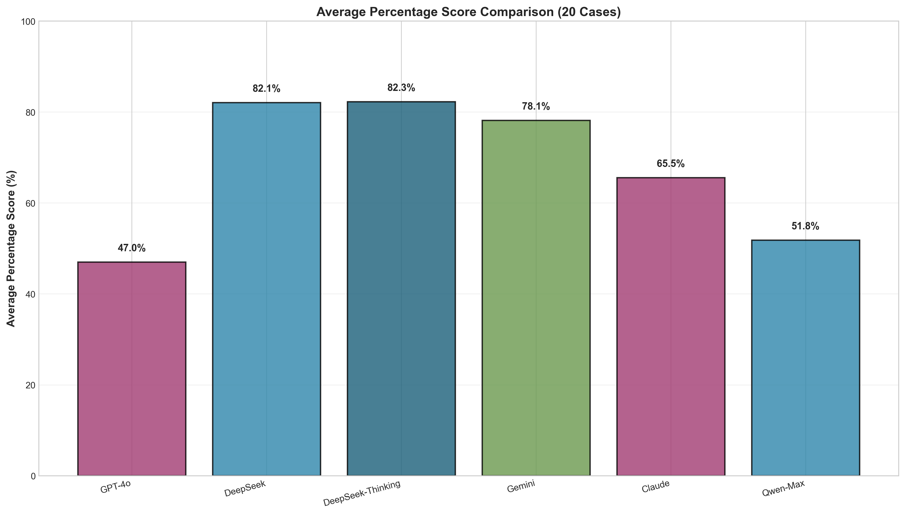
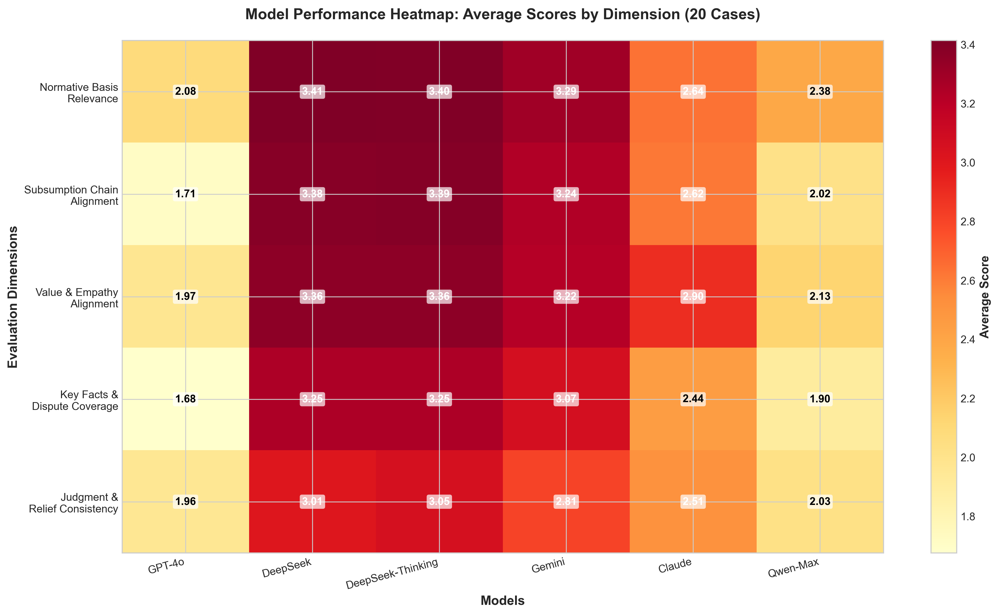
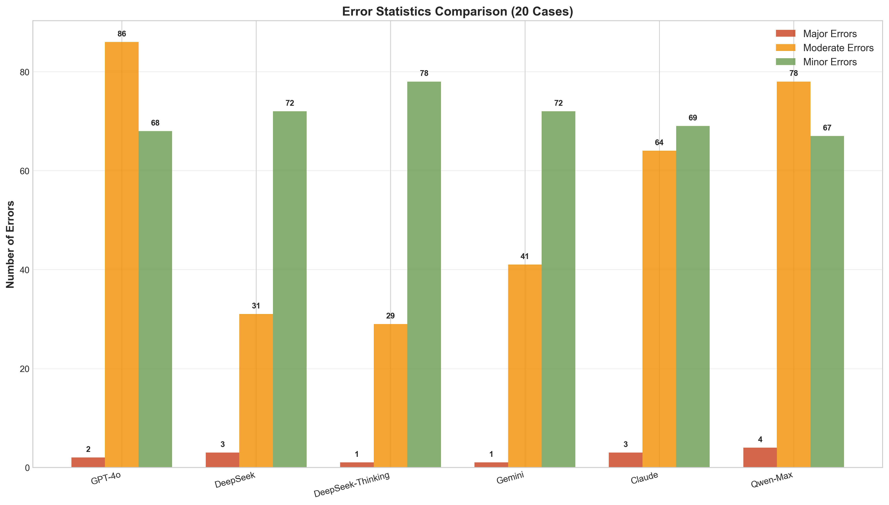
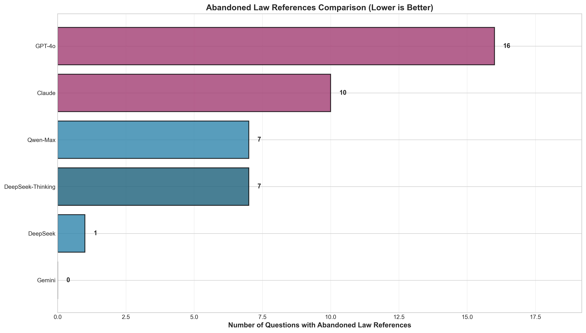
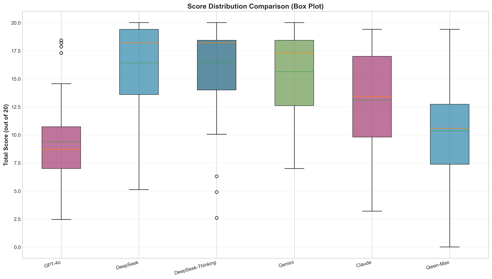
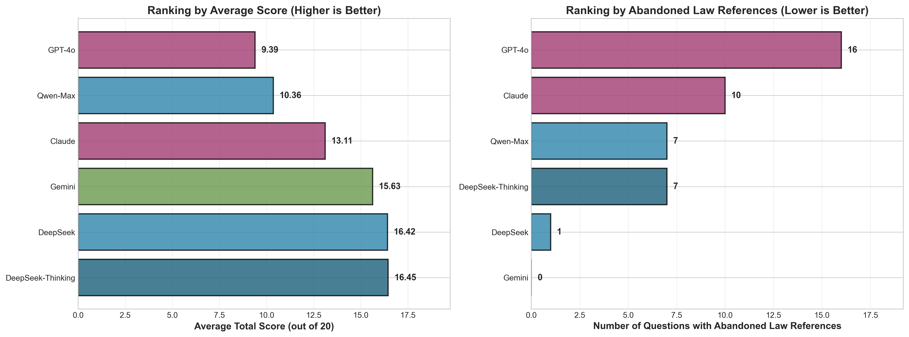
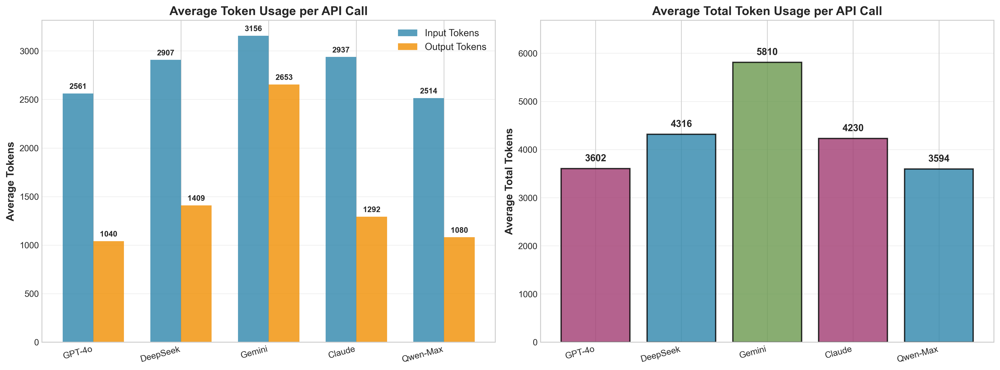

# 法律AI评估研究平台

<div align="center">


**一个专业的法律AI模型评估平台，支持多模型对比、自动化评估和结果可视化**

[功能特性](#功能特性) • [快速开始](#快速开始) • [评估框架](#评估框架) • [实验结果](#实验结果)

</div>

---

## 📖 项目简介

本项目是一个**法律AI模型评估研究平台**，旨在系统性地评估和对比多个大语言模型在法律案例分析任务中的表现。平台采用标准化的四阶段工作流程，通过五维评估标准对AI生成的法律分析进行量化评估。

### 核心特点

- 🔬 **科学评估**：基于《大陆法系演绎推理与价值衡量评分量表（Rubric v1.0）》的五维评估体系
- 🤖 **多模型支持**：支持GPT-4o、Claude Opus 4、Gemini 2.5 Flash、Qwen-Max、DeepSeek等多种模型
- 📊 **自动化流程**：从数据脱敏到结果评估的全自动化处理
- 📈 **可视化分析**：自动生成详细的对比图表和统计报告
- 🔒 **隐私保护**：自动脱敏处理，保护案例中的敏感信息

---

## ✨ 功能特性

### 1. 四阶段评估工作流程

```
┌─────────────┐    ┌─────────────┐    ┌─────────────┐    ┌─────────────┐
│  数据脱敏   │ -> │  问题生成   │ -> │  AI回答生成 │ -> │  答案评估   │
│  (DeepSeek) │    │  (DeepSeek) │    │ (多模型)    │    │  (DeepSeek) │
└─────────────┘    └─────────────┘    └─────────────┘    └─────────────┘
```

1. **数据脱敏**：使用DeepSeek API自动脱敏，保护隐私同时保留法律语义
2. **问题生成**：为每个案例自动生成5个法律争议问题
3. **AI回答生成**：支持多个模型并行处理，生成法律分析
4. **答案评估**：使用五维标准对AI回答进行量化评估

### 2. 五维评估标准

基于《大陆法系演绎推理与价值衡量评分量表（Rubric v1.0）》，每个维度0-4分，总分20分：

| 维度 | 说明 | 权重 |
|------|------|------|
| **规范依据相关性** | 法律条文、司法解释的引用是否与争议相关 | 4分 |
| **涵摄链条对齐度** | 是否形成完整的"争议→规范→要素→事实→结论"链条 | 4分 |
| **价值衡量与同理心对齐度** | 价值判断是否合理，是否避免偏见 | 4分 |
| **关键事实与争点覆盖度** | 是否准确捕捉关键事实，无虚构或误读 | 4分 |
| **裁判结论与救济配置一致性** | 结论和救济措施是否与法官判决一致 | 4分 |

### 3. 支持的模型

- **GPT-4o** (OpenAI)
- **Claude Opus 4** (Anthropic)
- **Gemini 2.5 Flash** (Google)
- **Qwen-Max** (阿里云)
- **DeepSeek** (Thinking模式)
- **DeepSeek-NoThinking** (标准模式)

---

## 🚀 快速开始

### 环境要求

- Python 3.11+
- 依赖包见 `requirements.txt`

### 安装步骤

```bash
# 1. 克隆仓库
git clone https://github.com/chenqianwan/huangyidan1.git
cd huangyidan

# 2. 安装依赖
pip install -r requirements.txt

# 3. 配置环境变量
# 创建 .env 文件，添加API密钥
DEEPSEEK_API_KEY=your_deepseek_api_key
OPENAI_API_KEY=your_openai_api_key
# ... 其他API密钥

# 4. 运行评估
python process_cases.py --model deepseek --case_ids case_001 case_002
```

### 使用示例

```bash
# 处理单个案例（所有模型）
./scripts/test_single_case_all_models.sh case_20251230_134952_90

# 处理多个案例（指定模型）
python process_cases.py \
  --model gpt4o \
  --use_ds_questions data/108个案例_新标准评估_完整版_最终版.xlsx \
  --case_ids case_001 case_002 case_003 \
  --standalone

# 生成报告和图表
python scripts/generate_results_for_current_folder.py
```

---

## 📊 实验结果

### 20个案例评估结果

我们使用20个真实法律案例对7个模型进行了全面评估，每个案例包含5个问题，共100个评估样本。

#### 模型性能对比




#### 详细统计

| 模型 | 平均分 | 百分制 | 最高分 | 最低分 | 引用废弃法案 |
|------|--------|--------|--------|--------|--------------|
| DeepSeek-Thinking | 16.45/20 | 82.3% | 20.00 | 2.60 | 7 |
| DeepSeek | 16.42/20 | 82.1% | 20.00 | 5.12 | 1 |
| Gemini 2.5 Flash | 15.63/20 | 78.1% | 20.00 | 7.00 | 0 |
| Claude Opus 4 | 13.11/20 | 65.5% | 19.40 | 3.20 | 10 |
| Qwen-Max | 10.36/20 | 51.8% | 19.40 | 0.00 | 7 |

#### 维度热力图



#### 错误统计



#### 引用废弃法案分析



#### 分数分布



#### 排名对比



#### Token使用统计



### 主要发现

1. **DeepSeek系列表现最佳**：DeepSeek-Thinking和DeepSeek在平均分上领先，分别达到82.3%和82.1%
2. **Gemini零引用废弃法案**：在避免引用废弃法案方面表现完美
3. **推理型模型优势明显**：DeepSeek-Thinking在复杂法律分析任务中表现更优
4. **模型间差异显著**：最高分和最低分相差约30个百分点

---

## 🔬 评估框架

### 评估标准

详细的评估标准请参考：[`static/evaluate/Scoring_Rubric_v1.0_English.md`](static/evaluate/Scoring_Rubric_v1.0_English.md)

### 评估流程

1. **数据准备**
   - 案例文本和法官判决
   - 自动脱敏处理

2. **问题生成**
   - 每个案例生成5个法律争议问题
   - 聚焦法律分析和价值判断

3. **模型回答**
   - 多模型并行处理
   - 任务自适应温度设置（0.3 for analysis）

4. **评估打分**
   - 五维标准量化评估
   - 自动错误检测和分类

5. **结果分析**
   - 自动生成对比图表
   - 详细统计报告

---

## 📁 项目结构

```
huangyidan/
├── app.py                          # Flask Web应用主文件
├── process_cases.py                # 案例处理主脚本
├── config.py                       # 配置文件
├── requirements.txt                # Python依赖
├── README.md                       # 项目说明文档
│
├── docs/                           # 文档目录
│   ├── workflow_description.md     # 工作流程描述
│   ├── API切换说明.md              # API使用说明
│   └── ...                        # 其他文档
│
├── scripts/                        # 辅助脚本目录
│   ├── generate_*.py              # 图表生成脚本
│   ├── test_*.py                  # 测试脚本
│   ├── *.sh                       # Shell脚本
│   └── ...                        # 其他辅助脚本
│
├── utils/                          # 工具模块
│   ├── ai_api.py                  # 统一AI API接口
│   ├── deepseek_api.py            # DeepSeek API封装
│   ├── evaluator.py               # 评估器
│   ├── data_masking.py            # 数据脱敏
│   └── ...
│
├── static/                         # 静态资源
│   ├── evaluate/                  # 评估标准文档
│   │   └── Scoring_Rubric_v1.0_English.md
│   ├── css/                       # 样式文件
│   └── js/                        # JavaScript文件
│
├── templates/                      # HTML模板
│   └── index.html
│
├── data/                          # 数据目录
│   ├── cases/                     # 案例数据
│   └── results_20260112_unified_e8fd22b9/  # 评估结果
│       ├── 20个案例_统一评估结果_108cases.xlsx
│       ├── chart_*.png            # 图表文件
│       └── results_详细报告_*.txt # 详细报告
│
└── logs/                          # 日志目录
```

---

## 📈 使用场景

### 研究用途

- **模型对比研究**：系统性对比不同模型在法律任务中的表现
- **评估标准验证**：验证五维评估标准的有效性和可靠性
- **模型能力分析**：深入分析各模型在不同维度上的优劣势

### 实践应用

- **法律AI选型**：为实际应用选择合适的AI模型
- **质量评估**：评估AI生成法律分析的质量
- **持续改进**：基于评估结果优化模型使用策略

---

## 🔧 技术栈

- **后端框架**：Flask 3.0
- **数据处理**：pandas, openpyxl
- **API集成**：OpenAI, Anthropic, Google, 阿里云, DeepSeek
- **可视化**：matplotlib, seaborn
- **并发处理**：concurrent.futures
- **前端**：HTML/CSS/JavaScript

---

## 📝 评估报告

详细的评估报告请查看：
- **最新报告**：`data/results_20260112_unified_e8fd22b9/results_详细报告_20260112_172609.txt`
- **完整数据**：`data/results_20260112_unified_e8fd22b9/20个案例_统一评估结果_108cases.xlsx`

---

## 🤝 贡献

欢迎提交Issue和Pull Request！

---

## 📄 许可证

MIT License

---

## 📧 联系方式

如有问题或建议，请通过GitHub Issues联系。

---

## 👥 作者

<div align="center">

<table>
<tr>
<td align="center" width="50%">
  
  <br>
  <strong>Huang Yidan</strong>
  <br>
  <a href="mailto:huangyidan@hkgai.org">huangyidan@hkgai.org</a>
</td>
<td align="center" width="50%">
  
  <br>
  <strong>Chen Long</strong>
  <br>
  <a href="mailto:chenlong@hkgai.org">chenlong@hkgai.org</a>
</td>
</tr>
</table>

---

**⭐ 如果这个项目对您有帮助，请给个Star！**

Made with ❤️ for Legal AI Research

</div>
