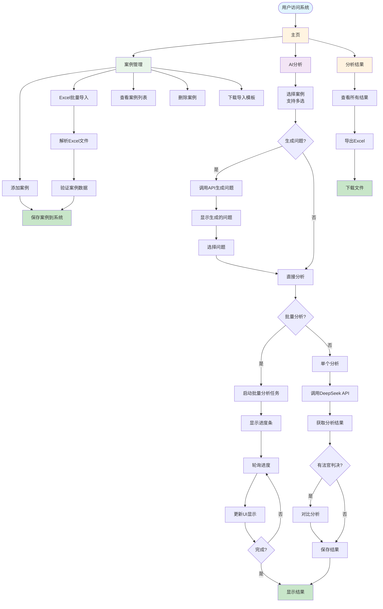
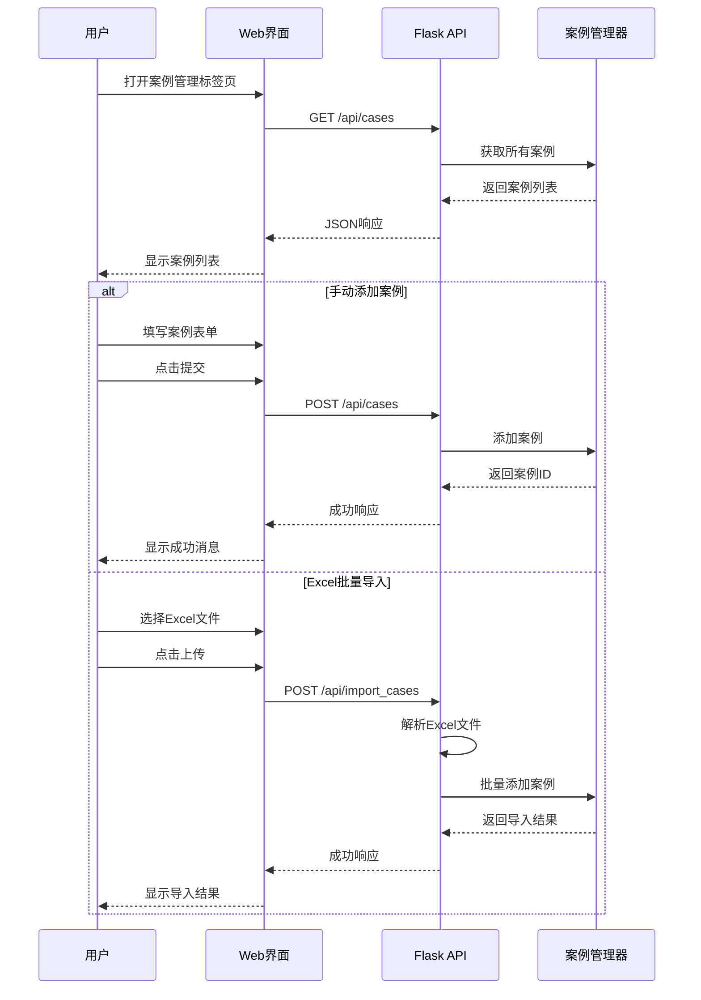
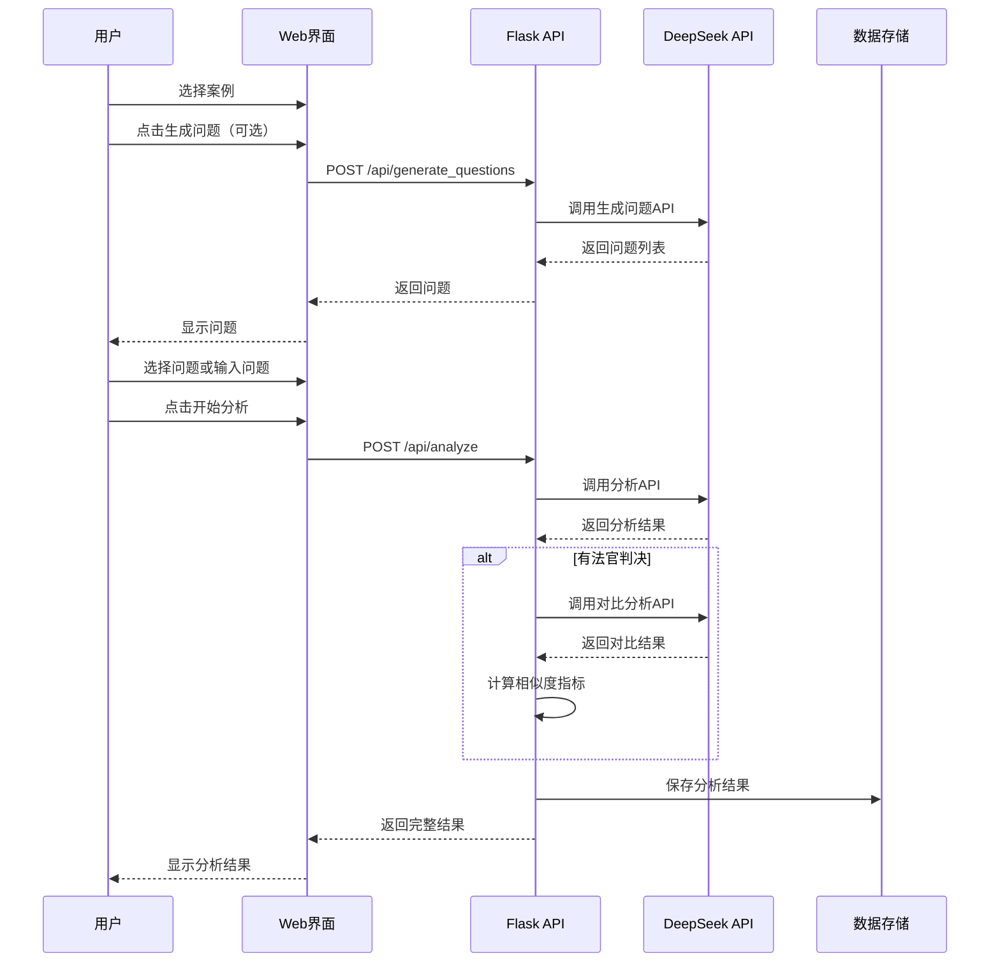
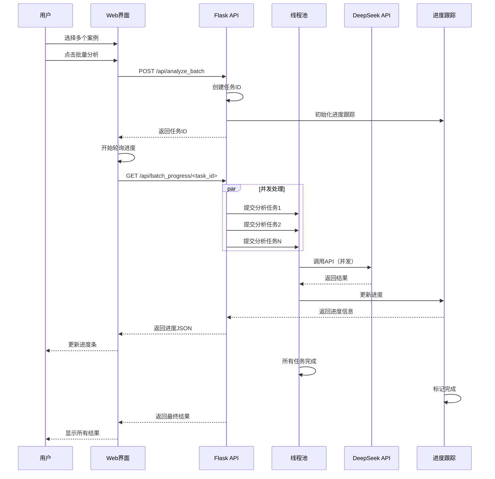
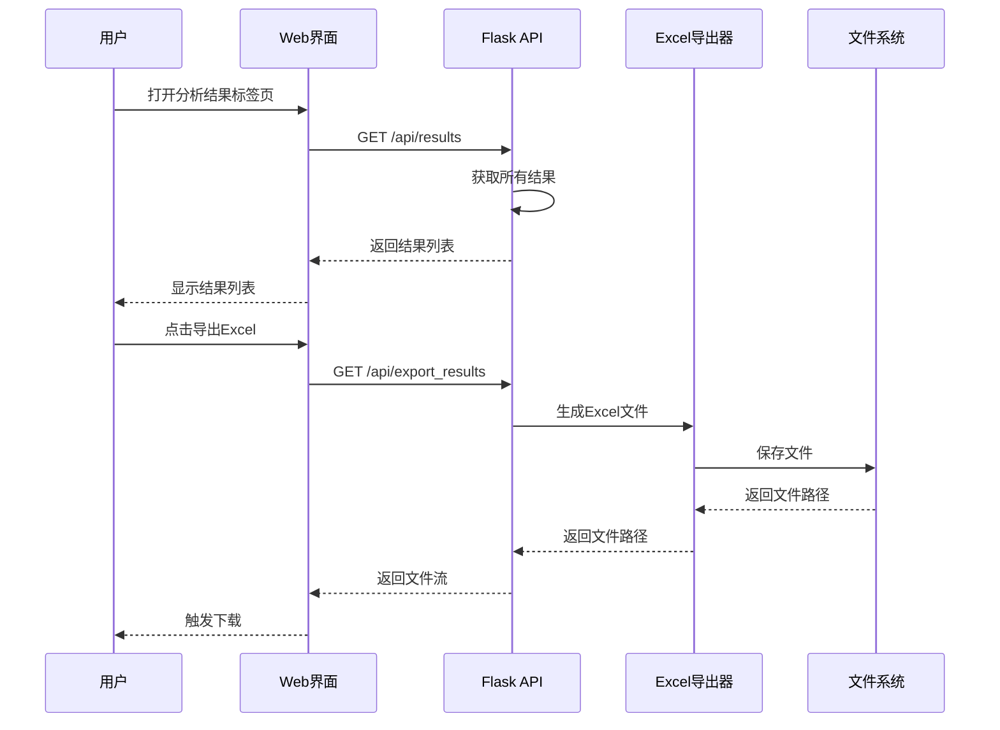
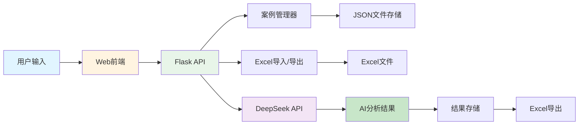

# 法律AI研究平台 - Web功能流程图

## 系统架构流程图

## 详细功能流程图

### 1. 案例管理流程

### 2. AI分析流程（单个）

### 3. AI分析流程（批量）

### 4. 结果导出流程

## 数据流图

## 主要功能模块

### 模块1: 案例管理
- ✅ 手动添加案例
- ✅ Excel批量导入
- ✅ 案例列表查看
- ✅ 案例删除
- ✅ 导入模板下载

### 模块2: AI分析
- ✅ 单个案例分析
- ✅ 批量案例分析（支持多选）
- ✅ 问题自动生成
- ✅ 进度实时显示
- ✅ 结果对比分析（如有法官判决）

### 模块3: 结果管理
- ✅ 结果列表查看
- ✅ Excel批量导出
- ✅ 相似度指标计算

## API端点列表

| 方法 | 路径 | 功能 |
|------|------|------|
| GET | `/` | 主页 |
| GET | `/api/cases` | 获取所有案例 |
| POST | `/api/cases` | 添加案例 |
| GET | `/api/cases/<id>` | 获取指定案例 |
| DELETE | `/api/cases/<id>` | 删除案例 |
| POST | `/api/import_cases` | Excel批量导入 |
| GET | `/api/download_template` | 下载导入模板 |
| POST | `/api/generate_questions` | 生成问题 |
| POST | `/api/analyze` | 单个分析 |
| POST | `/api/analyze_batch` | 批量分析 |
| GET | `/api/batch_progress/<task_id>` | 查询进度 |
| GET | `/api/results` | 获取所有结果 |
| GET | `/api/export_results` | 导出Excel |

## 技术特点

1. **并发处理**：使用ThreadPoolExecutor实现批量分析的并发处理
2. **进度跟踪**：实时显示批量分析的进度和状态
3. **错误处理**：完善的错误处理和重试机制
4. **速率限制**：API调用速率限制，防止超出限制
5. **Excel支持**：支持Excel导入和导出，方便批量操作

